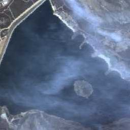
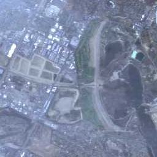
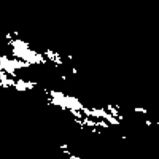
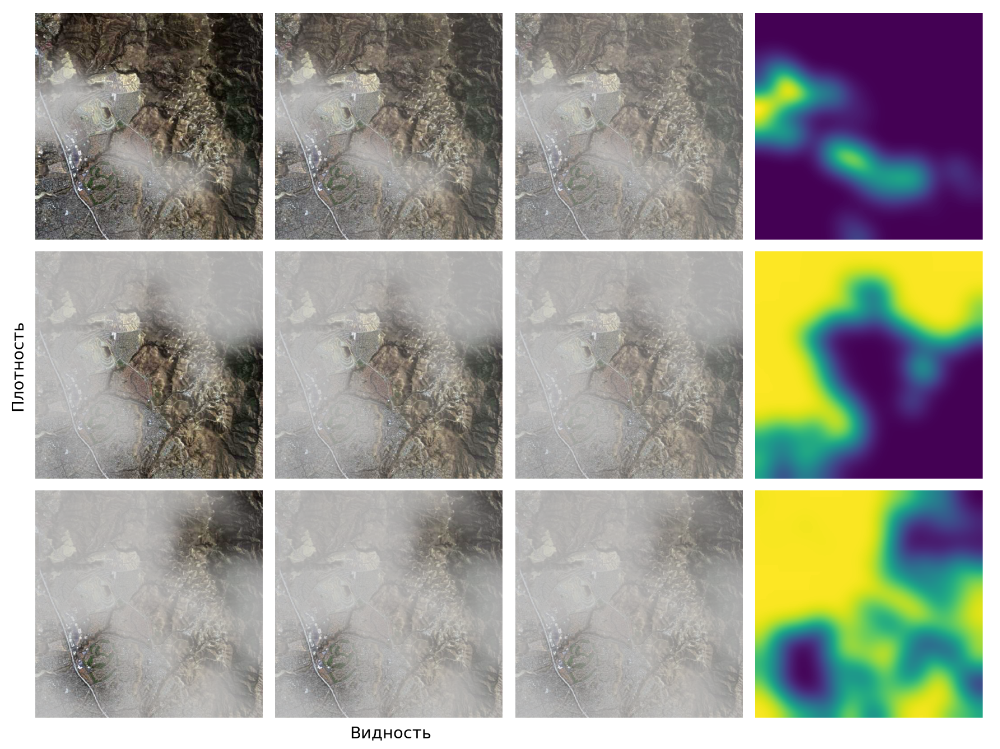
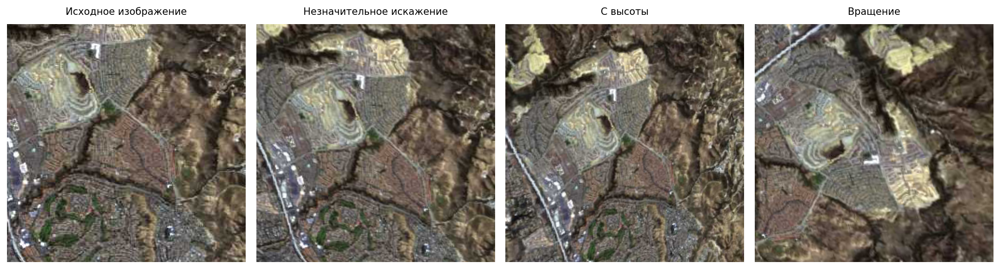
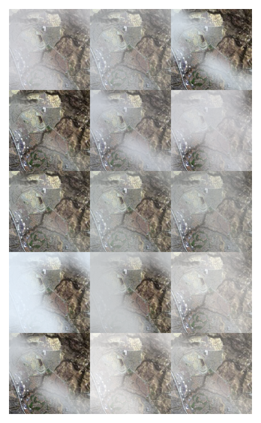
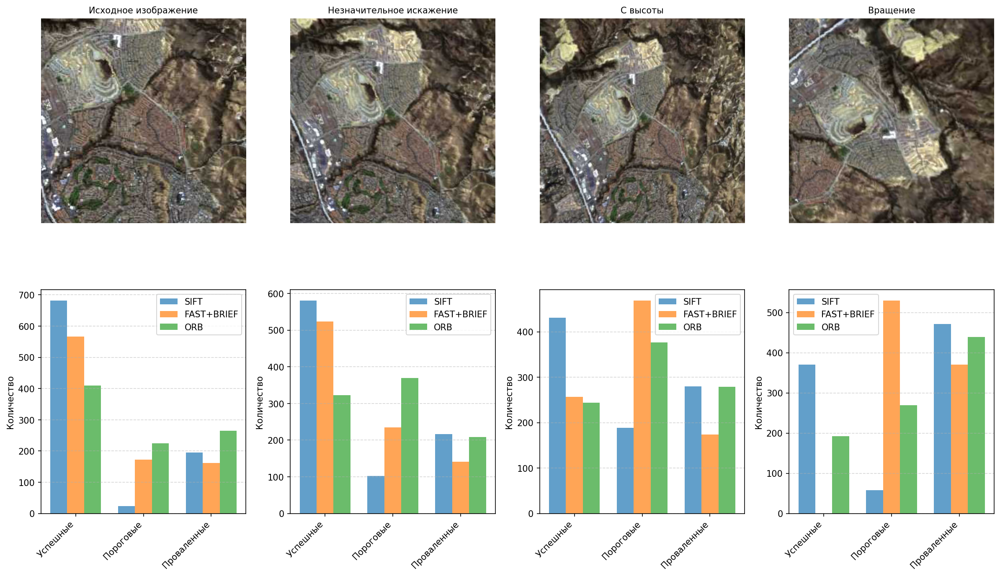
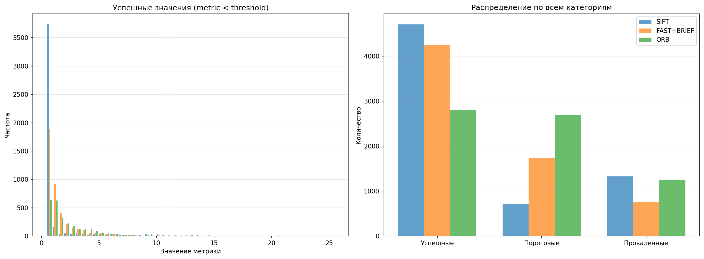
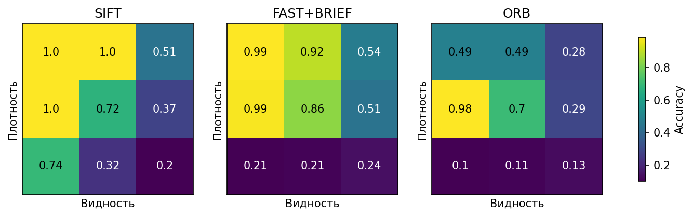
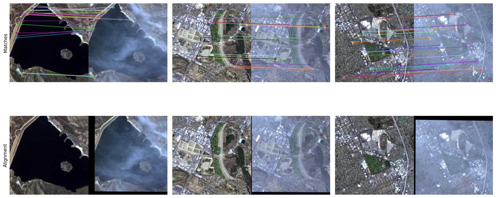

# Задача 18. Сопоставление сквозь туман

Предполагается, что слушатель знаком с:
* базовыми методами детекции и дескрипции особых точек
* моделью атмосферного рассеяния $\mathbf{I}(\mathbf{x}) = \mathbf{J}(\mathbf{x})t(\mathbf{x}) + \mathbf{A}(1 - t(\mathbf{x}))$
* невязками координат (критерий точности нормализации)

---

## Кратко о задании

1. Сравнение различных методов детекции и дескрипции особых точек на затуманенных изображениях с проективными искажениями
2. Характеристика зависимости точности оценки от параметров дымки

---

## Методы детекции и дескрипции

1. **SIFT** — точный, но медленный
2. **FAST+BRIEF** — быстрый, но менее устойчивый
3. **ORB** — баланс скорости и устойчивости

---

## Синтетическая дымка. Модель атмосферного рассеяния

#### Наблюдаемое задымлённое изображение:
$$
\mathbf{I}(\mathbf{x}) = \mathbf{J}(\mathbf{x})t(\mathbf{x}) + \mathbf{A}(1 - t(\mathbf{x})),
$$

- $\mathbf{A}$ — глобальный атмосферный свет
- $t(\mathbf{x})$ — коэффициент пропускания среды

### Зависимость коэффициента пропускания от глубины:
$$
t(\mathbf{x}) = e^{-\beta d(\mathbf{x})},
$$
- $\beta$ — коэффициент рассеяния атмосферы
- $d$ — глубина сцены

---

## Параметры неоднородности дымки

* Плотность
* Видность

---

## Моделирование неоднородности дымки

* Собственные идеи
* [Как делают другие](https://openaccess.thecvf.com/content/CVPR2022W/NTIRE/papers/Chen_Nonuniformly_Dehaze_Network_for_Visible_Remote_Sensing_Images_CVPRW_2022_paper.pdf)

---

## Моделирование неоднородности дымки

---

## Проективные искажения

---

## Готовимся к генерации данных

- $A$ — глобальный атмосферный свет ($A \in [200;255]^3$)
- $\beta$ — коэффициент рассеяния атмосферы ($\beta \in [0, 10]$)
* Плотность (классификация на 3)
* Видность (классификация на 3)
* Проективные искажения (классификация на 4)

---

## Метрики качества

* Среднеквадратичная невязка координат
* Максимальная невязка координат
* Точность

---

## Первые результаты

---

## Фиксируем проективное искажение

---

## Зависимость от типа однородности

---

## SIFT. Зависимость $L_\infty$ от $\beta$ и $A$

.png)

---

## Выводы

* В целом SIFT показывает лучшие результаты
* Для более однородного распределения FAST+BRIEF не уступает, а иногда превосходит другие методы
* ORB показывает худшие результаты при малых проективных искажениях
* При сильных искажениях FAST+BRIEF не работает

---

### SIFT. Сопоставление снимков с реальной дымкой

